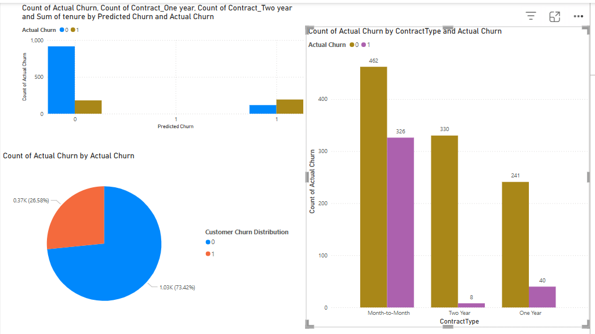

#  Customer churn-analysis

This project analyzes customer churn behavior using data science techniques and visualizes the insights using Power BI. The goal is to predict customer churn and understand the factors driving it, helping telecom companies retain customers more effectively.

---

## 📁 Project Structure

 churn-analysis
├── churn_dashboard.png # Power BI screenshot
├── churn.pbix # Power BI report file
├── churn_analysis.ipynb # Jupyter notebook (if available)
├── data/ # Dataset (or link in README)
└── README.md # This file

---

##  Tools & Technologies Used

- **Power BI** for interactive dashboards
- **Python** (optional: pandas, matplotlib, scikit-learn)
- **Machine Learning**: Logistic Regression, Random Forest
- **Git & GitHub** for version control
- **Jupyter Notebook** for model building (if applicable)

---

##  Power BI Churn Dashboard

This dashboard visualizes:
- Churn distribution (actual vs. predicted)
- Churn by contract type (Month-to-Month, One Year, Two Year)
- Breakdown of customers at risk

---

##  Key Insights

-  Customers on **Month-to-Month** contracts have the highest churn rate.
-  **Fiber optic** users showed increased churn likelihood compared to DSL.
-  High monthly charges and low tenure strongly correlate with churn.
-  Churn rate: **~26.58%** (from pie chart)

---

##  Machine Learning Model (optional)

- Models used: Logistic Regression, Random Forest
- Accuracy achieved: **~85%** (based on test data)
- Most influential features: `Contract`, `Tenure`, `MonthlyCharges`, `InternetService`

---

##  Dataset

This project uses the publicly available **Telco Customer Churn dataset**  
🔗 [Download from Kaggle](https://www.kaggle.com/datasets/blastchar/telco-customer-churn)

---

##  Download Report

You can download and explore the Power BI report directly:

➡ **[churn.pbix](churn.pbix)** (open with Power BI Desktop)
